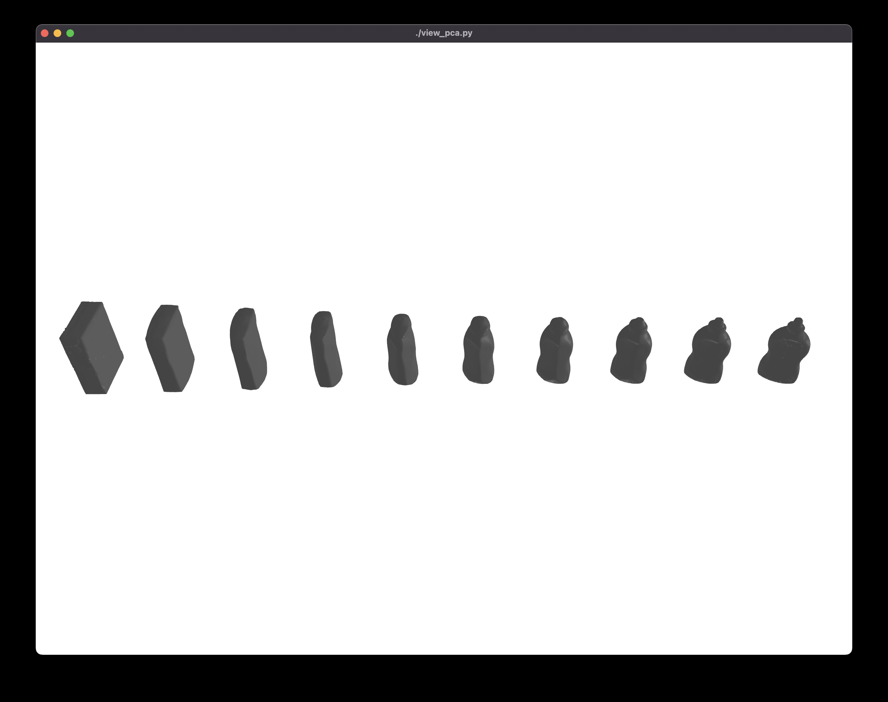

# sdf-object-model-descriptor

## Installation

```bash
pip install -r requirements.txt
```

## Usage

```bash
# download YCB mesh models
./download_data.py

# convert mesh to SDF
./convert_mesh_to_sdf.py

# visualize SDF
./view_sdf.py data/YCB_Video_Models/002_master_chef_can/sdf_64.npz

# apply PCA to get the descriptor
./fit_pca.py

# visualize descriptor interpolation
./view_pca.py
```


